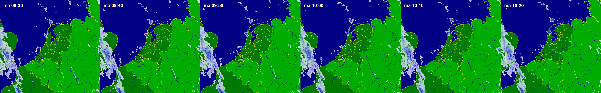

# Akte Radar

De Akte Radar is een 'radar' á la [buienradar](https://buienradar.nl) waarop de 'geraakte' percelen in de aktes van vandaag zichtbaar zijn gemaakt.

Kleur?
Status ELAN?

## Frontend

Buienradar maakt gebruik van een GIF. Deze bestaat uit alle kaartjes in één plaatje waar overheen 'geschoven' wordt.



De Frontend van AkteRadar kan vergelijkbaar werken. Dit is een JavaScript webapp waarin de GIF wordt opgehaald en getoond en overheen wordt 'geschoven'.

## Backend 

De backend van AkteRadar produceert de kaartjes van vandaag in één plaatje, een GIF. Het plaatje bestaat uit één kaartje per heel uur. Dat zijn maximaal 12 kaartjes, namelijk van 07.00 tot 19.00. De openingstijden van het Kadaster zijn van 09.00 tot 15.00 uur en we kunnen in de kaartjes (mogelijk) laten zien wat er binnen en buiten de openingstijden is binnengekomen.

Per dag is er slechts één plaatje beschikbaar. Dat maakt opvragen vanuit de frontend gemakkelijk. Bijvoorbeeld: https://akteradar.kadaster.nl/api/RadarMapAkteNL-20190909.png

Let op: `no-cache` zetten voor deze resource, zodat we het plaatje gedurende de dag kunnen vernieuwen met nieuwe data. (zie ook [stackoverflow issue 728616](https://stackoverflow.com/questions/728616/disable-cache-for-some-images))

### GIS Server

Voor de kaartjes is een GIS Server nodig. Welke? Via een `/poll` in Slack [#developers](https://kadaster-it.slack.com/archives/C0MGN3JBF/p1568022343021400) komt [MapServer](https://mapserver.org/) daar als favoriet uit. In de PDOK stack rondgekijkend, wordt daar gebruik gemaakt van de (Gemeente) [Amsterdam/mapserver](https://github.com/Amsterdam/mapserver). Dat lijkt een goed (en gemakkelijk) uitgangspunt.

De wijzigingen voor een extra dataset plus de definitie (`Mapfile`) voor de aktes (`akte_points`), staat in `./mapserver`.

Build MapServer: 
```
docker-compose -f docker-compose-tiles.yml build
```

Run MapServer: 
```
docker-compose -f docker-compose-tiles.yml run -p "8383:80" map
```

(of in één keer ;)
```
docker-compose -f docker-compose-tiles.yml build && docker-compose -f docker-compose-tiles.yml run -p "8383:80" map
```

Example WMS request: http://localhost:8383/cgi-bin/mapserv?map=/srv/mapserver/aktes.map&SERVICE=WMS&VERSION=1.3.0&REQUEST=GetMap&BBOX=5000,300000,300000,630000&CRS=EPSG:28992&WIDTH=1200&HEIGHT=1200&LAYERS=akte_points&STYLES=&FORMAT=image/png&DPI=96&MAP_RESOLUTION=96&FORMAT_OPTIONS=dpi:96&TRANSPARENT=false

Met specifieke datum/tijd query parameters `day`, `start_time` en `end_time` (format: `YYYYMMDDhh24miss`):
http://localhost:8383/cgi-bin/mapserv?map=/srv/mapserver/aktes.map&SERVICE=WMS&VERSION=1.3.0&REQUEST=GetMap&BBOX=5000,300000,300000,630000&CRS=EPSG:28992&WIDTH=1200&HEIGHT=1200&LAYERS=akte_points&STYLES=&FORMAT=image/png&DPI=96&MAP_RESOLUTION=96&FORMAT_OPTIONS=dpi:96&TRANSPARENT=false&day=20190905&start_time=1300&end_time=1500


## Data

De kaartjes bestaan uit twee data layers: de achtergrond en de akte data. De achtergrond kaart is een achtergrond kaart van PDOK. Aangezien deze weinig verandert, zou deze (hard) gecached kunnen worden.

### Akte Data

De akte data is uiteindelijk een kaartlaag met daarin geografische punten van percelen die in de aktes van vandaag genoemd zijn. Dus:

Akte - Perceel - Geografische locatie

De relatie van akte naar perceel ligt in ieder geval vast in KOERS. De data die nodig is, bevat geen persoonsgegevens, alleen akte referentie en akte tijdstip (tijdstip inschrijven + tijdstip verwerkt?), perceel referentie en geografische locatie. Eventueel kan de geografische locatie bepaald worden mbv het adres van het perceel icm de locatieservice van PDOK. In dat geval zijn wel de adresgegevens van de percelen benodigd.

**[CDMKAD](http://www.kadaster.nl/schemas/review-cdmkad/Januari2019/uml/index.html)** en **BRK-T** bevat `plaatscoordinaten` in het `Perceel` object. Dit is:

> Perceel.plaatscoordinaten is de aanduiding van een kaartpunt voor de weergave van de identificatie van een perceel (centroïde).
Door de keuze van het nulpunt geldt dat zowel de x-coordinaat als de y-coordinaat altijd positief zijn.  

Een `AppartementsRecht` bevat geen coördinaten, aangezien de locatie wordt bepaald door _alle_ grondpercelen waar het appartementsrecht aan verbonden is. Een `Leidingnetwerk` heeft ook geen coördinaten. <span style="background-color: yellow;">Voor de Akte Radar zijn daarom alleen percelen relevant.</span>

De akte data wordt voor het prototype door het KOERS Data Team opgeleverd mbv een handmatige query. Deze bevat records met:

- Stuk tijdstip
- Stuk ID
- Stuk aard
- Stuk deel en nummer
- Stukdeel ID
- Stukdeel aard
- Perceel X
- Perceel Y


Het resultaat van deze query is [20190905.csv](20190905.csv). Mbv enige MS Excel truckjes, is daar een 'load' query van te maken (resultaat: [20190905.xlsx](20190905.xlsx)):

```
drop table public.dataset_aktes;

create table public.dataset_aktes (
    id SERIAL PRIMARY KEY,
    stuk_tijdstip timestamp,
    stuk_ID varchar(255),
    stuk_aard varchar(255),
    stuk_deel_en_nummer varchar(255),
    stukdeel_ID varchar(255),
    stukdeel_aard varchar(255),
    Perceel_X float8,
    Perceel_Y float8,
    location GEOMETRY(POINT,28992)
);
```

```
="insert into public.dataset_aktes (
    stuk_tijdstip,
    stuk_ID,
    stuk_aard,
    stuk_deel_en_nummer,
    stukdeel_ID,
    stukdeel_aard,
    Perceel_X,
    Perceel_Y,
    location
)
values (
    '"&A2&"',
    '"&B2&"',
    '"&C2&"',
    '"&D2&"',
    '"&E2&"',
    '"&F2&"',
    "&G2&",
    "&H2&",
    'SRID=28992;POINT("&G2&" "&H2&")'
);"
```

load script (add with MS Excel column `I`):

```
drop table public.dataset_aktes;

create table public.dataset_aktes (
    id SERIAL PRIMARY KEY,
    stuk_tijdstip timestamp,
    stuk_ID varchar(255),
    stuk_aard varchar(255),
    stuk_deel_en_nummer varchar(255),
    stukdeel_ID varchar(255),
    stukdeel_aard varchar(255),
    Perceel_X float8,
    Perceel_Y float8,
    location GEOMETRY(POINT,28992)
);

insert into public.dataset_aktes (
    stuk_tijdstip,
    stuk_ID,
    stuk_aard,
    stuk_deel_en_nummer,
    stukdeel_ID,
    stukdeel_aard,
    Perceel_X,
    Perceel_Y,
    location
)
values 
```